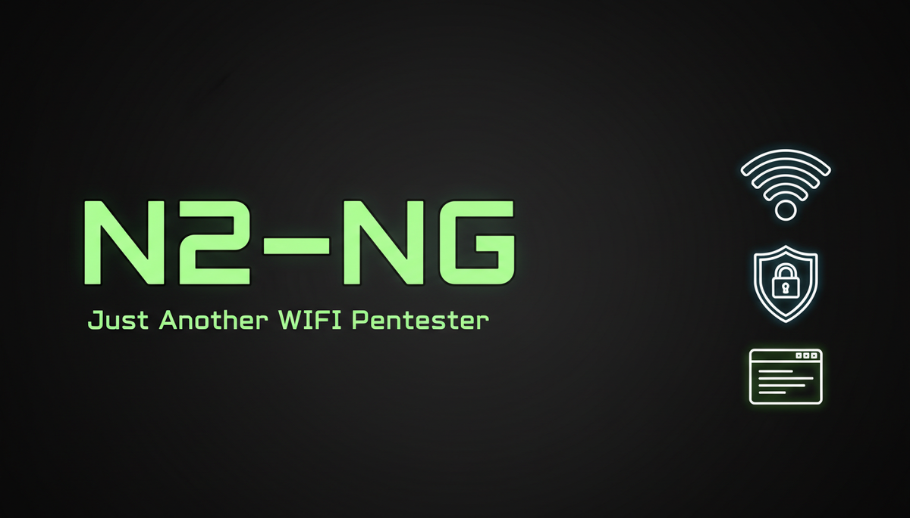
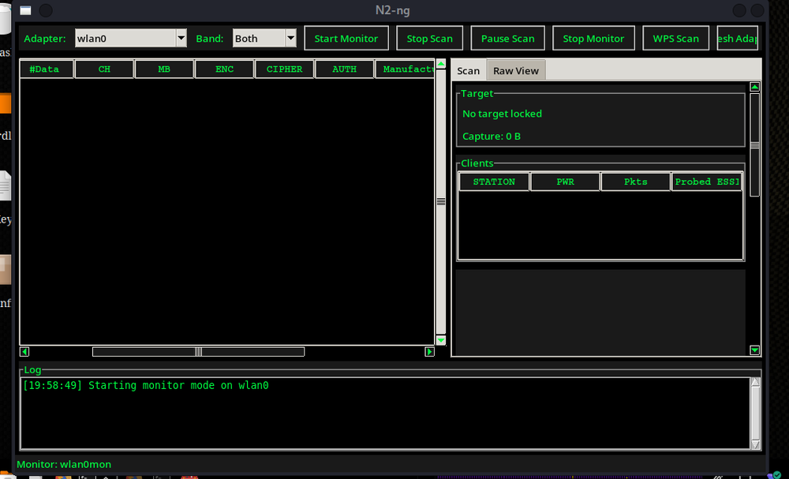
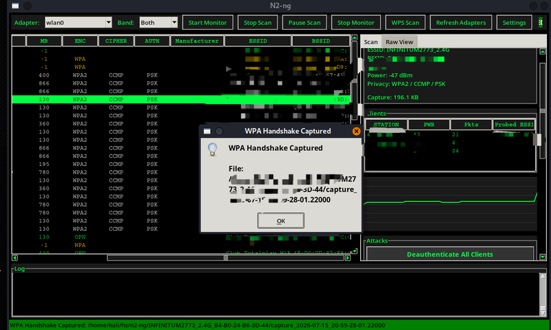
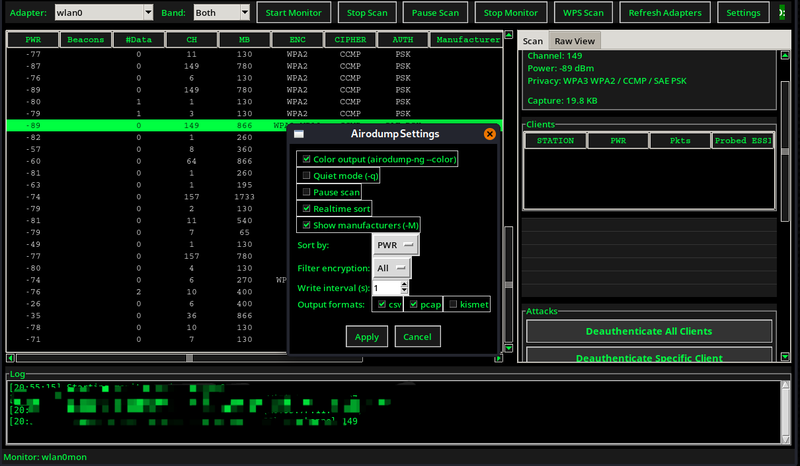

<p align="center">
  
</p>

<p align="center">
  <b>One window. One adapter. Zero terminal juggling.</b>
</p>

<p align="center">
  <a href="https://github.com/KiMiGuel/n2-ng/releases"></a>
  
  
  
  
</p>

---

## The Problem

You know the aircrack-ng suite is the best. You also know it has the UX of a 1990s router admin panel.

Three terminal windows. A cheat sheet. A prayer. Channel mismatch isn't a feature — it's a cry for help. Nobody should type `aireplay-ng --help` at 3 AM and question their life choices.

## The Solution

**N2-NG** wraps `airmon-ng` / `airodump-ng` / `aireplay-ng` into a single tkinter interface with actual words on buttons ("Deauthenticate," not "-0"), auto-handshake detection, live channel hopping, and none of the WEP museum exhibits.

Built for **Kali Linux**. Tested on caffeine. Approved by anyone who's ever forgotten which terminal had the monitor-mode adapter.

---

## Screenshots

<p align="center">
  
  <br><sub><i>Main interface — live scan with sortable columns, target panel, and client list</i></sub>
</p>

<p align="center">
  
  &nbsp;
  
  <br><sub><i>Left: Auto-handshake detection popup &nbsp;|&nbsp; Right: Configurable scan settings</i></sub>
</p>

---

## Features

| Feature | N2-NG | Raw aircrack-ng |
|---------|-------|-----------------|
| Single-window interface | ✅ | ❌ (3+ terminals) |
| Human-readable buttons ("Deauth" not `-0`) | ✅ | ❌ |
| Live channel-hopping scan | ✅ | Manual `-C` flags |
| Auto-handshake detection | ✅ | Wireshark eyeballing |
| Real-time BSSID/PWR/Beacons/#Data/CH/MB/ENC/CIPHER/AUTH/ESSID | ✅ | `airodump-ng` output |
| Sortable columns (PWR, Beacons, #Data) | ✅ | ❌ |
| Right-click context menu (cap merge/fix) | ✅ | Manual `mergecap` |
| .cap / .pcap / .22000 export | ✅ | Separate tools |
| Configurable output formats (csv, pcap, kismet) | ✅ | `-w` prefix only |
| Manufacturer detection | ✅ | `-M` flag needed |
| WPS Scan integration | ✅ | Separate `wash` tool |

---

## Quick Start

```bash
# Clone & install
git clone https://github.com/KiMiGuel/n2-ng.git
cd n2-ng
sudo ./install.sh

# Launch
n2-ng
```

Or install from the Debian package:

```bash
sudo dpkg -i n2-ng_0.1.0-1_all.deb
sudo apt-get install -f   # resolve any dependencies
```

---

## Dependencies

**Required:**
- Kali Linux or Debian-based distro
- Python 3.10+
- `python3-tk`
- `aircrack-ng`
- `wireless-tools`
- `scapy`

**Optional (recommended):**
- `hcxtools` — hashcat conversion support
- `reaver` — WPS PIN attacks
- `wireshark-common` — pcap analysis
- `pcapfix` — corrupted capture repair

All optional deps are checked at runtime — the tool warns you if something's missing instead of crashing.

---

## Documentation

- [Install Guide](docs/INSTALL.md) — detailed installation & troubleshooting
- [User Guide](docs/USER_GUIDE.md) — full feature walkthrough

---

## Why N2-NG Over...

**Wifite?** Wifite automates everything including cracking. N2-NG gives you full manual control with a GUI — pick your target, choose your attack, export clean captures. It's the difference between a scalpel and a sledgehammer.

**Fern WiFi Cracker?** Fern is bloated, outdated, and tries to do too much. N2-NG does one thing well: capture. No built-in dictionary attacks, no fluff. Just clean handshakes and PMKIDs.

**Raw aircrack-ng?** If you enjoy juggling `airmon-ng`, `airodump-ng`, `aireplay-ng`, `wash`, and `mergecap` across four terminals while praying you didn't typo the BSSID — keep doing you. Everyone else, there's N2-NG.

---

## Roadmap

- [x] Core GUI with live scan
- [x] Auto-handshake detection
- [x] Settings dialog (output formats, sort, filters)
- [ ] Clickable column sorting (high/low toggle)
- [ ] Cap merge/fix UI button (currently right-click only)
- [ ] PMKID-dedicated capture mode
- [ ] Dark/light theme toggle
- [ ] Export to hashcat (`-m 22000`) one-click

---

## Contributing

Found a bug? Got an idea? See [CONTRIBUTING.md](CONTRIBUTING.md).

Security concerns? See [SECURITY.md](SECURITY.md).

---

## License

GPL-3.0. See [LICENSE](LICENSE).

---

<p align="center">
  <sub>By <b>KiMiGuEL</b> — <a href="https://github.com/KiMiGuel">INDEPENTEST</a></sub>
</p>
