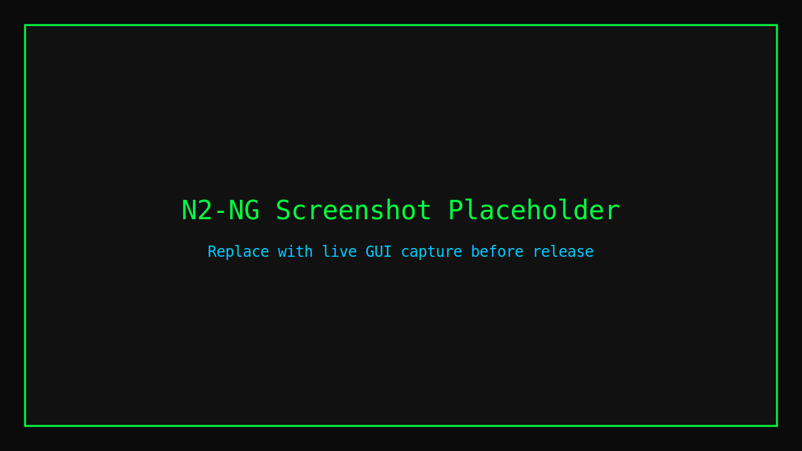

# N2-NG — Just another WiFi Pentester

**Author:** KiMiGuEL — INDEPENTEST


Just another WiFi Pentester

By KiMiGuEL — INDEPENTEST

I have spent more time googling "why does aireplay -b mean something else" than actually capturing handshakes. I know the aircrack-ng suite is the best. I also know it has the UX of a 1990s router admin panel.

You shouldn't need three terminal windows, a cheat sheet, and a prayer just to deauth a client. Channel mismatch isn't a feature. It's a cry for help.

One window. One adapter. One brain cell required. N2-ng wraps airmon-ng / airodump-ng / aireplay-ng into a single tkinter interface with actual words on buttons ("Deauthenticate," not "-0"), auto-handshake detection, and none of the WEP museum exhibits.

Built for Kali. Tested on caffeine. Approved by anyone who's ever typed aireplay-ng --help at 3 AM and questioned their life choices.

## Features

- Single-window tkinter GUI
- Live channel-hopping WiFi scan
- Auto-handshake detection
- PMKID and EAPOL capture
- Human-readable button labels ("Deauthenticate," not "-0")
- Real-time BSSID/PWR/Beacons/#Data/CH/MB/ENC/CIPHER/AUTH/ESSID display
- Sortable columns (PWR, Beacons, #Data — high→low, low→high)
- Right-click context menu for cap merge/fix
- .cap / .pcap / .22000 export support

## Screenshot



## Quick Start

```bash
git clone https://github.com/KiMiGuel/n2-ng.git
cd n2-ng
sudo ./install.sh
```

Run:

```bash
n2-ng
```

## Dependencies

- Kali Linux or Debian-based Linux
- Python 3
- python3-tk
- aircrack-ng
- wireless-tools
- scapy
- Optional: hcxtools, reaver, wireshark-common, pcapfix

## Guides

- [Install guide](docs/INSTALL.md)
- [User guide](docs/USER_GUIDE.md)

## Confirmed Working

- Handshake capture verified on author's own router
- Real-time display refresh
- Channel hopping scan

## Future Fixes / Roadmap

- Column sorting: PWR, Beacons, #Data columns need clickable sort (high→low, low→high)
- Cap merge/fix: Currently only accessible via right-click context menu — needs visible UI button
- These are confirmed working but need UX polish

## License

GPL-3.0. See [LICENSE](LICENSE).
